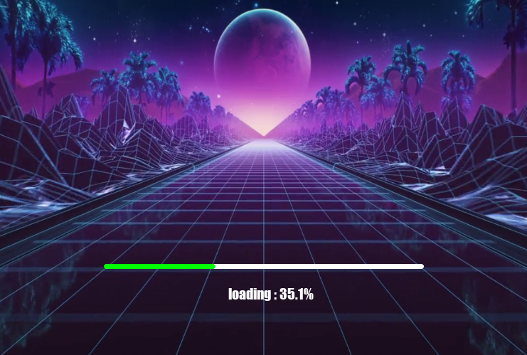

# splashscreen-engine
A module for making Splash Screens with videos, images, loading bars, text rendering, and threaded rendering support for your Applications.

## Sample Preview


## Features

- Background videos
- Background images
- Loading bars
- Text rendering
- Transparency support
- Threaded rendering
- Video looping
- Simple API

## Installation

```bash
pip install splashscreen-engine
```

## Example

```python
import splashscreen_engine as splash

screen = splash.Screen()
screen.size(750,500)

# This Starts The Engine
screen.start()

# Background Video
video = splash.BackgroundVideo(
    screen,
    "exampleVid.mp4",
    fps=30,
    loop=True
)

video.play()

# Loading Bar
bar = splash.LoadingBar(screen)
bar.place()

# Text `loading`
text = splash.Text(
    screen,
    "Loading...",
    "impact",
    20,
    (325,400)
)

text.show()

# LOADING | you can add your `loading` processes here

a = 0

while not a >= 100:

    a += 0.3

    text.edit(
        text=f"loading : {round(a,2)}%"
    )

    bar.set_progress(a)

    screen.wait(0.05)

text.edit(
    text="loaded : 100%"
)

screen.wait(3)

# Stop the splash screen after loading
screen.stop()


"""
if you are using pygame module in your own code,
use `screen.stop(quit_pygame=False)`
instead of `screen.stop()`
"""

# Main Screen Example

import tkinter # pip install tkinter -- used as main screen for example.
main_screen = tkinter.Tk()

main_screen.geometry("750x500")

main_text = tkinter.Label(
    main_screen,
    text="Your Main Screen",
    font=("impact",40)
)

main_text.pack()

main_screen.mainloop()
```

---

## Requirements

- pygame
- opencv-python
- numpy

---

# Functions

### Basic Window

```python
import splashscreen_engine as splash

screen = splash.Screen()

screen.size(750, 500)

screen.start()
```

#### Stop and Delete Screen

```python
screen.stop()

# Use:
screen.stop(quit_pygame=False)

# if you are using pygame in your own application.
```

#### Set Size for your window

```python
screen.size(750,500)

# Arguments:
# width, height, fullscreen

# OR

screen.size(fullscreen=True)
```

#### Set title for your window

```python
screen.title("Your Title")
```

#### Set Background color

```python
screen.set_bg_color((255,0,0)) # Red
```

---

### Wait Function

Instead of using `time.sleep()`,
you can use this function because it prevents
the `window not responding` issue.

```python
screen.wait(0.5) # Seconds
```

---

### Background Video

You can add a video as the background
of your splash screen using this function.

```python
video = splash.BackgroundVideo(
    screen,
    "exampleVid.mp4",
    fps=30,
    loop=True
)

# loop = True / False
# default(False)

# fps = int
# default(30)
```

#### Play video

```python
video.play()
```

#### Pause video

```python
video.pause()
```

#### Resume video

```python
video.resume()
```

#### Delete video

```python
video.delete()
```

#### Transparency

Make your video transparent.

Transparency Level:
`0 to 255`

Default:
`120`

```python
video.transparency(150)
```

#### Stop Transparency

```python
video.stop_transparency()
```

#### Stopping / Resuming Video Loops

```python
# Loop Video
video.loop = True

# Stop the Loop
video.stop_loop()

# OR
video.loop = False
```

#### To check whether the video is playing or stopped

```python
# Returns True if playing else False
video.playing()
```

---

### Background Image

You can add an image as the background
of your splash screen using this function.

```python
bg_img = splash.BackgroundImage(
    screen,
    "YourImage.png"
)

bg_img.set()
```

---

### Progress Bar

This function adds a progress bar.

```python
bar = splash.LoadingBar(
    screen
)

# Arguments:
# parent, width, height

bar.place()

# Arguments:
# x, y, colour, loading_colour
```

#### Hiding the Progress Bar

```python
bar.hide()
```

#### Setting Progress

```python
bar.set_progress(50)
```

---

### Text

Adds text on the screen.

```python
text = splash.Text(
    screen,
    "Loading...",
    "impact",
    20,
    (325,400)
)

# Arguments:
# parent, text, font,
# size, position, colour

text.show()
```

#### Show and Hide text

```python
# Show text
text.show()

# Hide text
text.hide()
```
---
## Contributing & Feedback

Discuss approaches, Suggest new features,
Report bugs, or Share improvements through GitHub
issues and discussions.
or mail at : chhabranaman21@gmail.com
---
