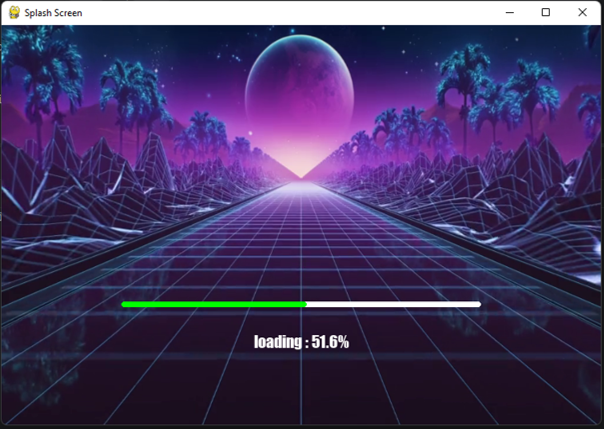

# splashscreen-engine
A module for making Splash Screens with videos, images, loading bars, text rendering, and threaded rendering support for your Applications.
## Sample Preview

You can find these template codes here:
[Templates](https://github.com/NamanChhabra21/splashscreen-engine/tree/main/Templates)

<table>
<tr>
<td align="center">

### Loading Please Wait
Template 1


</td>

<td align="center">

### Loading Please Wait
Template 3


</td>
</tr>

<tr>
<td align="center">

### Loading Please Wait
Template 2


</td>

<td align="center">

### Loading Please Wait
Template 4


</td>
</tr>
</table>

## Features

- Optional Title Bar
- Dynamic Window Resizing
- Fullscreen Support
- Background videos
- Background images
- Video-powered loading bars
- Text rendering
- Transparency support
- Threaded rendering
- Video looping
- Simple API

## Installation

```bash
pip install splashscreen-engine
```
> [!NOTE]
> Windows is currently the primary supported platform.

## Quick Start

```python
import splashscreen_engine as splash

screen = splash.Screen()

screen.start()

video = splash.BackgroundVideo(
    screen,
    "video.mp4"
)

video.play()

screen.wait(5)

screen.stop()

```

---

## Requirements
These Modules are automatically installed with : `pip install splashscreen-engine`
- pygame
- opencv-python
- numpy

---

# Functions

### Basic Window

```python
import splashscreen_engine as splash

screen = splash.Screen()

screen.size(750, 500)

screen.start()
```

#### Stop and Delete Screen

```python
screen.stop()

# Use:
screen.stop(quit_pygame=False)

# if you are using pygame in your own application.
```

#### Set Size for your window

```python
screen.size(750,500)

# Arguments:
# width, height, fullscreen

# OR

screen.size(fullscreen=True)
```

#### Set title for your window

```python
screen.title("Your Title")
```

#### Set Background color

```python
screen.set_bg_color((255,0,0)) # Red
```

#### Get Window Size

```python
width,height = screen.get_size()
```

---
### Window with Title bar (optional)
A title bar is the top bar of a window.
It usually contains:

- window title
- close button
- minimize button
- maximize button
- Note : Clicking on Maximize / Minimize button automatically resizes the screen

---

---
#### To create a Title Bar
```python
screen = splash.Screen(title_bar=True)
```
#### Functions for Title Bar
##### Adding an Icon
```python
screen.set_icon("YourIcon.png")
```
##### To Check if the user clicked on `X` button
```python
screen.is_quit()
```
##### To check if the user pressed `Esc` Key during fullscreen
```python
screen.is_escaped()
```
##### Note : These functions are only applicable when `title_bar = True` else it will raise an error.
---
### Wait Function

Instead of using `time.sleep()`,
you can use this function because it prevents
the `window not responding` issue.

```python
screen.wait(0.5) # Seconds
```

---

### Background Video

You can add a video as the background
of your splash screen using this function.

```python
video = splash.BackgroundVideo(
    screen,
    "exampleVid.mp4",
    fps=30,
    loop=True
)

# loop = True / False
# default(False)

# fps = int
# default(30)
```

#### Play video

```python
video.play()
```

#### Pause video

```python
video.pause()
```

#### Resume video

```python
video.resume()
```

#### Delete video

```python
video.delete()
```

#### Transparency

Make your video transparent.

Transparency Level:
`0 to 255`

Default:
`120`

```python
video.transparency(150)
```

#### Stop Transparency

```python
video.stop_transparency()
```

#### Stopping / Resuming Video Loops

```python
# Loop Video
video.loop = True

# Stop the Loop
video.stop_loop()

# OR
video.loop = False
```

#### To check whether the video is playing or stopped

```python
# Returns True if playing else False
video.playing()
```

---

### Background Image

You can add an image as the background
of your splash screen using this function.

```python
bg_img = splash.BackgroundImage(
    screen,
    "YourImage.png"
)

bg_img.set()
```

---

### Progress Bar

This function adds a progress bar.

```python
bar = splash.LoadingBar(
    screen,
    position="down",
    add_xy=(0,-50)
)

# Arguments:
# parent, width, height,
# position, add_xy

bar.place()

# Arguments:
# colour, loading_colour
```
#### Video Loading Bar

You can use videos inside the loading area of the progress bar.

```python
video_bar = splash.LoadingBar(screen,width=500,height=25)
video_bar.set_video("Examplevideos/BarVid.mp4")

video_bar.place()
```

The video automatically fills according to:

```python
video_bar.set_progress(value)
```

This creates animated loading effects inside the progress bar.

#### Available Positions

```python
"center"
"right"
"left"
"up"
"down"
```


#### Hiding the Progress Bar

```python
bar.hide()
```

#### Setting Progress

```python
bar.set_progress(50)
```

---

### Text

Adds text on the screen.

```python
text = splash.Text(
    screen,
    "Loading...",
    "impact",
    20,
    position="center",
    add_xy=(0,0)
)

# Arguments:
# parent, text, font,
# size, position,
# add_xy, colour

text.show()
```

#### Available Positions

```python
"center"
"right"
"left"
"up"
"down"
```


#### Show and Hide text

```python
# Show text
text.show()

# Hide text
text.hide()
```

---

#### Edit The Text | Supports Dynamic Editing

This allows you to edit the text dynamically.

Example:
Changing:
`f"Loading {i}%"`
inside loops.

```python
text.edit(
    text = "New Loading Text Added",
    font = "IMPACT",
    new_size = 20,
    position = "center",
    add_xy = (0,0),
    colour = (0,255,0)
)
```
---
### `add_xy` Argument

`add_xy` allows you to move objects relative to their selected position.

Structure:

```python
add_xy = (x,y)
```

| Value | Meaning |
|---|---|
| Positive `x` | Move Right |
| Negative `x` | Move Left |
| Positive `y` | Move Down |
| Negative `y` | Move Up |

Example:

```python
text = splash.Text(
    screen,
    "Loading...",
    position="center",
    add_xy=(0,-100)
)
```

This places the text:
- Horizontally centered
- 100 pixels above the center

---
### Getting Documentation
```python
documentation = splash.Documentation()
```
#### Opening Documentation
This opens `README.md` file on Github
```python
documentation.open()
```
#### Contact Details
This prints all the contact details
```python
documentation.contact()
```
---
## Contributing & Feedback

Discuss approaches, suggest new features,
report bugs, or share improvements through GitHub
issues and discussions.

##### Mail:
chhabranaman21@gmail.com
##### PyPI:
https://pypi.org/project/splashscreen-engine

---
## Keywords

#### pygame, splash screen, loading screen, opencv, video rendering, python GUI, pygame framework, splashscreen, animated loader, desktop application, threaded rendering
---

<p align="center">
  
</p>
